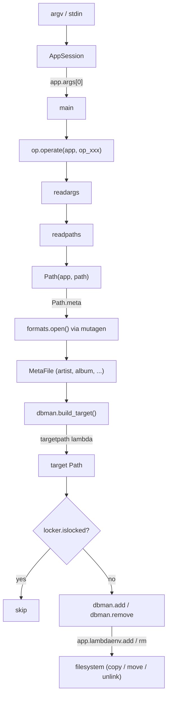

# Architecture

Musync is a music organizer that sorts audio files into a configurable
directory layout derived from their metadata (artist, album, title, track,
year).  It reads tags via [mutagen](https://mutagen.readthedocs.io/),
computes a target path through user-defined Python lambdas, and copies or
moves the file into the library.  Source files are never modified unless the
configuration explicitly says so.

## Startup

```
musync:entrypoint  (pyproject.toml script)
        │
        ▼
  AppSession(argv)          opts.py – parse config files, CLI flags
        │
        ▼
    main(app)               __init__.py – dispatch on operation name
        │
        ▼
  op.operate(app, op_xxx)   op.py – iterate paths, call operation callback
```

`entrypoint()` creates an `AppSession`, which loads configuration and CLI
options into a `LambdaEnviron`.  If the session is not fully configured
(missing config file, invalid root, etc.) the process exits immediately.
`main()` inspects `app.args[0]` to select an operation callback and hands it
to `op.operate()`.

## Module map

| Module | Responsibility |
|---|---|
| `__init__.py` | `entrypoint()`, `main()`, operation callbacks (`op_add`, `op_remove`, `op_fix`, `op_lock`, `op_unlock`, `op_inspect`) |
| `opts.py` | `AppSession`, INI config loading with overlay sections, CLI parsing, `LambdaEnviron` (dict that stores all runtime settings and callable lambdas) |
| `op.py` | `operate()` loop, `readargs()` (stdin or trailing args), `readpaths()` (build `Path` objects, recurse into directories) |
| `dbman.py` | `build_target()`, `add()` (copy/move + optional hash check), `remove()` |
| `commons.py` | `Path` – filesystem wrapper carrying path components, metadata, and helpers (`inroot`, `children`, `walk`, `rmdir`) |
| `formats/` | Mutagen-based metadata readers dispatched by tag type (ID3, OggVorbis, FLAC, MP4) |
| `locker.py` | `LockFileDB` – flat-file database (one path per line) for locking paths against modification |
| `printer.py` | `TermCaps` / `AppPrinter` – colored terminal output via curses termcaps |
| `rulelexer.py` | `RuleLexer` / `RuleBook` – parser for unicode and regex replacement rules used by `cfilter` |
| `custom.py` | Helper functions (`md5sum`, `foreign`, `ue`, `lexer`, `case`, `system`, `execute`, `filter`, `in_tmp`) available inside config lambdas |
| `errors.py` | `WarningException` (non-fatal, skip file) and `FatalException` (abort) |
| `sign.py` | SIGINT / SIGTERM handler; sets an `Interrupt` flag checked by `operate()` |

## Operations

| Command | Effect |
|---|---|
| `add` / `sync` | Read metadata, compute target path, copy or move file into the library |
| `rm` / `remove` | Locate the library copy of a file and delete it |
| `fix` | Compare a file's current path against its computed target; relocate if they differ, remove empty directories |
| `lock` | Add a path to the lock database so it is skipped by add/remove/fix |
| `unlock` | Remove a path from the lock database |
| `inspect` | Print metadata and the computed target path without changing anything |

## Data flow



## Configuration system

Configuration uses INI files parsed by `RawConfigParser`.  Musync looks for
config files in order:

1. `/etc/musync.conf`
2. `~/.musync`

A config file has three kinds of sections:

- **`[import]`** – Python modules to import into the lambda environment
  (e.g. `os`, `shutil`, `musync.custom`).
- **`[general]`** – Base settings: `root`, `pretend`, `force`, `checkhash`,
  and the required lambdas (`add`, `rm`, `hash`, `targetpath`, `checkhash`,
  `lockdb`).
- **Overlay sections** (`[copy]`, `[move]`, `[dap]`, …) – Selected with
  `-c copy,move`.  Each overlay's keys are `eval()`-ed and merged into
  `LambdaEnviron`, overriding earlier values.

Every value in `[general]` and overlay sections is evaluated with
`eval(val, self.lambdaenv)`, so values can be arbitrary Python expressions
or lambda functions that reference previously imported modules and earlier
settings.  Circular overlay references are detected and rejected.

### Required lambdas

| Key | Signature | Purpose |
|---|---|---|
| `add` | `(src, dst)` | Copy or move a source file to the target path |
| `rm` | `(path)` | Delete a file |
| `hash` | `(path)` | Return a checksum for integrity verification |
| `targetpath` | `(source_path)` | Compute the relative target path from metadata |
| `checkhash` | (bool) | Whether to verify file integrity after add |
| `root` | (string) | Absolute path to the library root |

## Design patterns

- **Strategy** – `add`, `rm`, `hash`, and `targetpath` are swappable
  lambdas loaded from the config file, letting users change copy vs. move
  behavior or transcoding pipelines without touching code.
- **Configuration overlays** – Sections like `[copy]` and `[move]` act as
  layers over `[general]`, composable via `-c`.
- **Format dispatch** – `formats.open()` inspects the mutagen tag type and
  returns the matching `MetaFile` subclass (ID3, OggVorbis, FLAC, MP4).
- **Visitor iteration** – `op.operate()` iterates over paths and applies an
  operation callback, decoupling traversal from action.
- **Rule-based naming** – `rulelexer.py` provides a mini-language for
  regex/unicode replacement rules consumed by `custom.lexer()` to normalize
  filenames (e.g. diacritics to ASCII).
